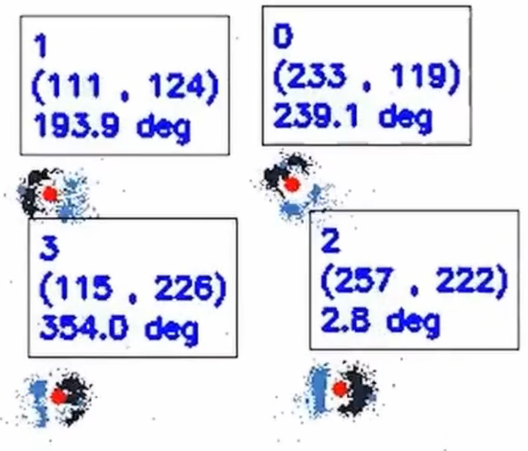

# Event Camera Based Real-Time Detection and Tracking of Indoor Ground Robots

by
Himanshu Patel,
Craig Iaboni,
Deepan Lobo,
Ji-won Choi,
Pramod Abichandani

This paper has been submitted for publication in IEEE Transactions on Pattern Analysis and Machine Intelligence.

## Abstract

This paper presents a real-time method to detect and track multiple mobile ground robots using event cameras. 
The method uses density-based spatial clustering of applications with noise (DBSCAN) to detect the robots and a single k-dimensional (k−d) tree 
to accurately keep track of them as they move in an indoor arena. Robust detections and tracks are maintained in the face of event camera noise 
and lack of events (due to robots moving slowly or stopping). An off-the-shelf RGB camera-based tracking system was used to provide ground truth. 
Experiments including up to 4 robots are performed to study the effect of i) varying DBSCAN parameters, ii) the event accumulation time, iii) 
the number of robots in the arena, and iv) the speed of the robots on the detection and tracking performance. The experimental results showed 
100% detection and tracking fidelity in the face of event camera noise and robots stopping for tests involving up to 3 robots (and upwards of 93% for 4 robots).

## Software implementation

This software uses DBSCAN clustering and a k-d tree to locate centroids of ground robots in motion.
Each robot's centroid coordinates, unique ID, and heading angle is tracked.

The data used in this study is provided in `data`. 
Data is provided in csv format and was captured as asyncronous events from a Dynamic Vision Sensor.

## Getting the code

You can download a copy of all the files in this repository by cloning the
[git](https://git-scm.com/) repository:

    git clone https://github.com/radlab-sketch/radvision.git

## Dependencies

You'll need a working Python environment to run the code.
The current Python version can be downloaded through
[Python.org](https://www.python.org/downloads/). The current version at this time of writing is Python 3.9.

The required dependencies are specified below with an installation command.
   
      python -m pip install scikit-learn kdtree pytz numpy opencv-python

## Running the code

To run the software, run this in the top level of the repository:

    python radvision.py

A graphical window will appear and show the detection and tracking in progress.

A log file for the test will be created in at the top level. 
This file is in .csv format and named with a timestamp.
The rows of the log file correspond to the information about one robot, and the format is as follows:

Timestamp (in seconds), frame number, X position, Y position, heading angle, identification label

## License

All source code is made available under a BSD 3-clause license. You can freely
use and modify the code, without warranty, so long as you provide attribution
to the authors. See `LICENSE.md` for the full license text.

The manuscript text is not open source. The authors reserve the rights to the
article content, which is currently submitted for publication in IEEE Transactions on Pattern Analysis and Machine Intelligence.
